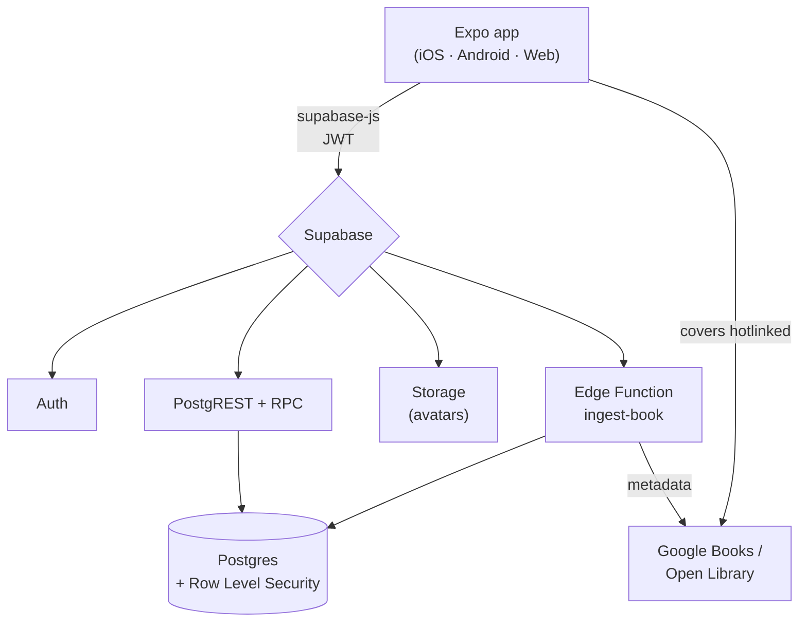

# jacopoz

**Social book discovery.** Not a catalog, not a Goodreads clone — an app where
you discover your next book through **people with similar taste**. Netflix-style
discovery, a Twitter/Reddit-style community, on top of a Goodreads-grade catalog.

> The value isn't the books. It's discovering books through people like you.

---

## Status

This repository contains a **complete, implementation-ready private beta** (target
100–500 users, ~€0 infrastructure cost).

| Layer | State | Verification |
|---|---|---|
| Database & backend logic | ✅ Complete | All 10 migrations + seed applied and exercised on **Postgres 16**; recommendation, feed, counters, RLS all tested end-to-end |
| Mobile/web app (Expo) | ✅ Beta feature-complete | `tsc --noEmit` clean; `expo export` produces a working bundle (every screen/import resolves) |
| Documentation | ✅ Complete | PRD, architecture, DB, API, algorithms, security, roadmap, install, deploy |
| Gamification | 🟡 Designed only | Tables wired (levels/XP/streak/achievements); no logic yet, by design |
| Monetization | 🟡 Architected | Affiliate links live; Premium entitlement modelled; ads OFF |

The one thing you must provision to run it: **a free Supabase project.** Nothing else.

---

## Quick start

```bash
# 1. Backend — apply schema + seed to a Supabase project (or `supabase start`)
supabase link --project-ref <your-ref>
supabase db push          # applies supabase/migrations
psql "$SUPABASE_DB_URL" -f supabase/seed.sql

# 2. App
cd app
cp .env.example .env      # fill EXPO_PUBLIC_SUPABASE_URL / _ANON_KEY
npm install
npx expo start            # press i / a / w for iOS / Android / web
```

Full details: **[docs/INSTALL.md](docs/INSTALL.md)** · Deploy: **[docs/DEPLOY.md](docs/DEPLOY.md)**

---

## Architecture at a glance

Supabase *is* the backend — no servers to run, no ML infra. The "algorithms" are
transparent SQL functions (RPC), so they're readable and swappable.



- **Client:** Expo Router + TypeScript + TanStack Query (cache) + a thin typed API layer.
- **Security:** Row Level Security on every table — open reads, owner-scoped writes,
  moderator-gated moderation. The anon key is public by design.
- **Catalog:** one canonical `books` table, deduped by ISBN-13 then title+author, with
  an external-id map so ingestion is idempotent (no split-community duplicate books).

More: **[docs/ARCHITECTURE.md](docs/ARCHITECTURE.md)** · **[docs/DATABASE.md](docs/DATABASE.md)** · **[docs/API.md](docs/API.md)**

---

## Implemented features (beta)

- ✅ **Auth** — email/password via Supabase Auth; profile auto-provisioned on signup.
- ✅ **Onboarding taste picker** — genres captured up front; solves reco cold-start.
- ✅ **Netflix-style home** — hero + *For You*, *Popular*, per-genre, and *New releases* rows.
- ✅ **Search** — accent/typo-tolerant catalog search, with background import from providers.
- ✅ **Book page** — cover, meta, average rating, categories, description, community reviews.
- ✅ **Shelves** — mark **read**, **save**, **like**, and **rate** (1–5).
- ✅ **Reviews** — one per book/user; rating-only or long-form; spoiler flag.
- ✅ **Community** — comments, **one-level replies**, likes on reviews and comments.
- ✅ **Ranked feed** — non-chronological, personalized (see below), optimistic likes.
- ✅ **Profiles** — own + public, with basic stats (read / reviews / likes / followers) and shelf grids.
- ✅ **Follows**, **reporting + moderation** (content lifecycle + moderator role), **analytics events**.
- ✅ **Affiliate** — Amazon buy button built from ISBN + a rotatable tag.

Deferred by design: gamification activation, push notifications, realtime, reading-progress
posts, Premium features, ads. See **[docs/ROADMAP-BACKLOG.md](docs/ROADMAP-BACKLOG.md)**.

---

## The algorithms (no ML, on purpose)

**Recommendations** — a transparent cascade, excluding books already on your shelf:

```
score = 0.35·genre_affinity + 0.25·author_affinity
      + 0.25·collaborative(taste-neighbours) + 0.15·popularity
```

New users still get results from their onboarding genres + popularity, so the home is
never empty. *Worked example: a fantasy reader who loved Sanderson gets "The Way of Kings"
at 0.925 — "Because you read authors you love".*

**Community feed** — ranked, not chronological:

```
score = 0.30·engagement + 0.20·quality + 0.20·affinity + 0.30·freshness(48h half-life)
```

Both are single SQL functions with the weights as constants — swap the weights, or
replace the whole function with an ML model behind the same signature, without touching
the app. Deep dive: **[docs/ALGORITHMS.md](docs/ALGORITHMS.md)**.

---

## Repository structure

```
jacopoz/
├── app/                      # Expo (React Native + TS) client
│   ├── app/                  # Expo Router routes (screens)
│   └── src/                  # api/ components/ store/ theme/ types/ lib/
├── supabase/
│   ├── migrations/           # 0001..0010 — schema, RLS, RPCs, scaffolds
│   ├── functions/ingest-book # Edge Function: canonical catalog ingestion
│   ├── seed.sql              # genres, achievements, config, 20 curated books
│   └── config.toml
└── docs/                     # PRD, architecture, DB, API, algorithms, roadmap, …
```

---

## Key architectural decisions (the "why")

1. **Supabase over a custom backend** — Auth + Postgres + Storage + Edge Functions in one
   managed, ~free service. Fastest path to a beta; RLS gives real security without an API tier.
2. **Algorithms as SQL RPC, not a service** — transparent, versioned with the schema, and
   swappable for ML later behind the same signature. No separate infra to run.
3. **Canonical book catalog with dedup** — the single most important data decision; prevents
   duplicate book pages from splitting the community's reviews.
4. **`user_books.rating` is the single source of truth** for a book's average rating;
   `reviews.rating` is only a display snapshot. Counters maintained by triggers, never on read.
5. **Hotlink covers, don't store them** — zero storage cost and no copyright exposure; only
   user avatars live in Storage.
6. **Gamification & monetization wired but dormant** — tables exist now so activating them
   later never requires migrating a hot table. Ads ship OFF; affiliate is the only live channel.
7. **One Expo codebase** for iOS, Android, and web — the web build (used for this repo's
   bundle smoke test) also gives a near-free landing/beta surface.

Full critical review (risks, severities, fixes): **[docs/CTO-REVIEW.md](docs/CTO-REVIEW.md)**.

---

## Documentation index

| Doc | What's in it |
|---|---|
| [PRD.md](docs/PRD.md) | Vision, personas, scope (MVP/Beta/v2), success metrics |
| [CTO-REVIEW.md](docs/CTO-REVIEW.md) | Founder-level critique: risks, severity, fixes |
| [ARCHITECTURE.md](docs/ARCHITECTURE.md) | System design, diagrams, data & auth flows |
| [DATABASE.md](docs/DATABASE.md) | ER diagram, per-table reference, triggers, RLS |
| [API.md](docs/API.md) | PostgREST, RPCs, Edge Function, analytics vocabulary |
| [ALGORITHMS.md](docs/ALGORITHMS.md) | Recommendation + feed ranking, tuning, ML-swap |
| [SECURITY-MODERATION.md](docs/SECURITY-MODERATION.md) | RLS, auth, moderation, secrets, GDPR |
| [ROADMAP-BACKLOG.md](docs/ROADMAP-BACKLOG.md) | Phased roadmap, prioritized TODO, v2 backlog |
| [INSTALL.md](docs/INSTALL.md) · [DEPLOY.md](docs/DEPLOY.md) | Local setup · shipping the beta |
