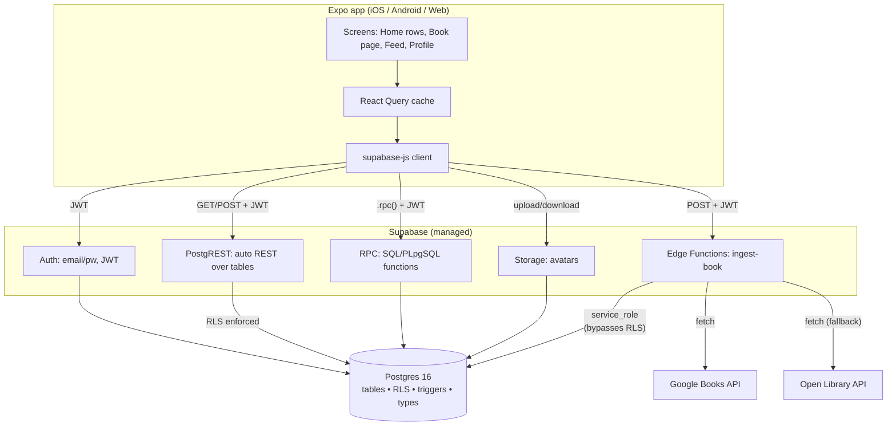
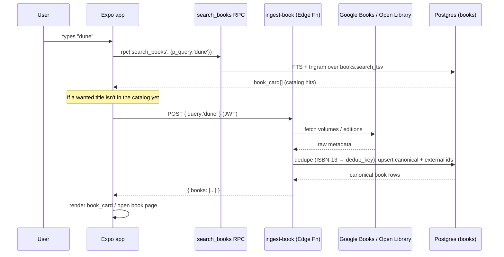
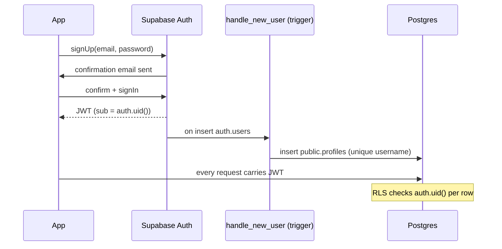

# jacopoz — System Architecture

A single Expo codebase talking to Supabase (Auth, PostgREST/RPC, Storage, Edge Functions) over one
Postgres database. No separate backend service. Discovery/feed "algorithms" live inside Postgres as SQL
RPCs. Target: ~€0 infra for a 100–500 user private beta.

---

## 1. Diagram

---

## 2. Layers

- **Expo app** (`app/`, React Native 0.76 + Expo 52 + expo-router). One codebase → iOS, Android, Web
  (`react-native-web`). Talks to Supabase exclusively through `@supabase/supabase-js`. Session tokens
  persisted with `expo-secure-store` (native) / storage adapter. Server state via **React Query**.
- **Supabase Auth.** Email/password with email confirmation. Issues a JWT carrying `sub = auth.uid()`.
  A signup trigger (`handle_new_user`, SECURITY DEFINER) auto-creates the matching `public.profiles`
  row with a de-duplicated username.
- **PostgREST.** Auto-generated REST over `public` tables. Every request carries the user's JWT; **RLS
  is the authorization layer** (default deny, open reads, owner writes). No hand-written CRUD endpoints.
- **RPC.** The read-side "algorithms" and racy write actions are Postgres functions exposed over
  PostgREST's `/rpc`. Called from the client via `supabase.rpc(name, params)`.
- **Storage.** Avatars only (≤5 MiB). Book covers are hotlinked, not stored.
- **Edge Functions.** `ingest-book` (Deno) is the **single writer to the catalog**, running under the
  service_role key (bypasses RLS), calling Google Books then Open Library.
- **Postgres 16.** The source of truth: tables, enum types, RLS policies, denormalization triggers, and
  the RPC functions themselves. Schema is fully migration-managed (`supabase/migrations/0001..0010`).

---

## 3. Why Supabase

- **One managed backend** covers auth, database, object storage, and serverless functions — no infra to
  run, fits the ~€0 beta budget and a tiny team.
- **RLS = authorization in the database**, so an auto-generated REST API is safe to expose directly; we
  don't write or maintain a CRUD service.
- **Functions in Postgres** let the discovery logic live next to the data (no N+1 round trips) and ship
  as versioned migrations.
- **Portability:** it is standard Postgres. If we outgrow Supabase, the schema, RLS, and RPCs move to
  any Postgres host; only Auth/Storage/Edge wiring changes.

---

## 4. Data flow: search → ingest → display

Key point: **search reads the local canonical catalog** (fast, offline of providers); **ingestion is the
only path that mutates the catalog**, deduping so a work exists once regardless of provider/edition.

---

## 5. Auth flow (Supabase Auth · JWT · RLS)

- The JWT's `sub` is `auth.uid()`. Every table/RPC decision is expressed against `auth.uid()`.
- `auth.users` is never exposed to clients; `public.profiles` is the only user-facing identity, created
  by the SECURITY DEFINER signup trigger.
- Elevated actions gate on `is_moderator()` (reads `profiles.role`). Deleting an `auth.users` row
  cascades to profile and all owned content.

---

## 6. Why algorithms live as SQL RPC

- **Transparent.** Weights are constants at the top of `get_recommendations` / `get_community_feed`
  (see `ALGORITHMS.md`). No black box, easy to reason about at beta scale.
- **Colocated with data.** Ranking runs where the rows live — one round trip, no client-side joins over
  paged data, no server tier to host.
- **Swappable.** Each RPC has a stable **signature and composite return type** (`book_card`,
  `book_reco`, `feed_item`). Replacing the heuristic with an ML scorer later means changing the function
  body (or pointing it at an external scorer) while the app keeps calling the same `.rpc()` — no app
  change, no contract break.
- **Versioned.** Functions are migrations, so algorithm changes are reviewed and rolled forward/back
  like any schema change.

---

## 7. Caching strategy

- **Client cache: React Query.** Home rows, feed pages, book pages, profiles are cached with sensible
  stale times; pull-to-refresh / invalidation on write. This absorbs most read traffic at beta scale.
- **Server-side denormalization instead of query caches.** Every hot count is trigger-maintained
  (`followers_count`, `following_count`, `books_read_count`, per-book `saves/reads/likes/reviews_count`,
  `rating_sum`/`rating_count`, `reviews.like_count`/`comment_count`, `comments.like_count`/`reply_count`,
  `reviews.quality_score`). Reads never aggregate → cheap even without a cache tier.
- **No CDN needed for beta.** Covers are hotlinked from providers (they serve them from their own CDNs);
  only avatars sit in Storage. If cover hotlinking gets flaky we cache to Storage later without a schema
  change (`cover_url` is provider-agnostic).

---

## 8. How gamification / monetization plug in later without migrating hot tables

The costly-to-migrate tables (`profiles`, `books`, `user_books`, `reviews`) are **already forward-wired**:

- `profiles.points` column exists (unused). `activities` (0007) is an append-only action log that a
  future points engine can replay — no trigger wired yet, so beta writes stay cheap.
- **Gamification tables** (`user_gamification`, `xp_ledger`, `achievements`, `user_achievements`, 0008)
  exist with **public reads and no client writes**. Activation = turn on a SECURITY DEFINER / service_role
  "points engine" that appends to `xp_ledger` (the source of truth) and updates the derived cache. No
  migration of hot tables.
- **Monetization** (0009): `entitlements` + `is_premium()` + `app_config` flags are present.
  Enabling premium/ads = flip `app_config` values and wire a billing webhook (service_role) — again no
  hot-table migration. Affiliate is already live via `amazon_affiliate_url`.

This is deliberate: the schema pays a small "cold storage" cost now to avoid migrating high-traffic
tables under load in v2.
