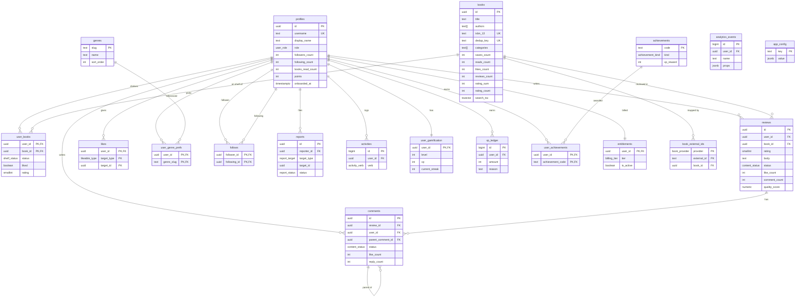

# jacopoz — Database Schema Reference

Postgres 16, schema `public`. Fully migration-managed (`supabase/migrations/0001..0010`, `seed.sql`).
Reads are open, writes are owner-scoped (RLS, default deny). Denormalized counters are trigger-maintained
so reads never aggregate.

---

## 1. ER diagram (main entities)

---

## 2. Enum types

| Type | Values |
|---|---|
| `user_role` | `user`, `moderator`, `admin` |
| `book_provider` | `google_books`, `open_library`, `manual` |
| `shelf_status` | `want_to_read`, `reading`, `read` |
| `content_status` | `visible`, `hidden`, `removed` |
| `likeable_type` | `review`, `comment` |
| `report_target` | `review`, `comment`, `profile`, `book` |
| `report_status` | `open`, `reviewing`, `resolved`, `dismissed` |
| `activity_verb` | `finished_book`, `saved_book`, `liked_book`, `wrote_review`, `commented`, `followed` |
| `achievement_kind` | `badge`, `achievement`, `milestone` |
| `billing_tier` | `free`, `premium` |

---

## 3. Per-table reference

### profiles (0002)
- **Purpose:** user-facing identity, 1:1 with `auth.users` (`id` FK, `on delete cascade`). `auth.users`
  is never exposed to clients.
- **Key columns:** `username` (unique, `^[a-z0-9_]{3,24}$`), `display_name` (1–60), `bio` (≤300),
  `avatar_url`, `role` (default `user`). Denormalized counters `followers_count`, `following_count`,
  `books_read_count`. Scaffold: `points` (unused), `onboarded_at` (onboarding completion).
- **Triggers:** `on_auth_user_created` (on `auth.users`, SECURITY DEFINER) inserts the profile with a
  de-duplicated username; `profiles_set_updated_at`. Counters written by `follows_after_change` and
  `user_books_after_change`.
- **Indexes:** trigram GIN on `username`.
- **RLS:** read by everyone; UPDATE only own row. No client INSERT (trigger only). DELETE via cascade.

### genres (0002)
- **Purpose:** small controlled vocabulary (slug PK) driving onboarding + reco. Seeded in `seed.sql`.
- **RLS:** read by everyone; no client writes (reference data).

### books (0002) — canonical catalog
- **Purpose:** one row per work, deduped across providers. **Only `ingest-book` (service_role) writes it.**
- **Key columns:** `title`, `subtitle`, `authors text[]`, `description`, `cover_url` (hotlinked),
  `published_year`, `page_count`, `language`, `isbn_13` (**unique**), `isbn_10`, `categories text[]`
  (subset of `genres.slug`), **`dedup_key`** (`slugify(title)|slugify(first-author)`, **unique**).
  Denormalized popularity: `saves_count`, `reads_count`, `likes_count`, `reviews_count`, `rating_sum`,
  `rating_count`. `search_tsv` is a generated `tsvector` (title=A, authors=B, categories=C, unaccented).
- **Triggers:** `books_set_updated_at`. Counters maintained by `user_books_after_change` (popularity +
  ratings) and `reviews_after_change` (`reviews_count` only).
- **Indexes:** unique `dedup_key`; GIN on `search_tsv`, on unaccented title trigram, on `categories`,
  on `authors`; popularity btree on `(reads+saves+likes) desc`.
- **Helper:** `book_avg_rating(books)` = `round(rating_sum/rating_count, 2)` or NULL.
- **RLS:** read by everyone; no client writes.

### book_external_ids (0002)
- **Purpose:** `(provider, external_id) → book_id` map so ingestion resolves "already in catalog?"
  cheaply and idempotently. PK `(provider, external_id)`; `book_id` FK cascade.
- **RLS:** read by everyone; writes via service_role (ingestion).

### user_books (0002) — the shelf
- **Purpose:** one row per `(user, book)` holding shelf status, like flag, and personal rating.
  **Absence of a row = no interaction.**
- **Key columns:** PK `(user_id, book_id)`; `status shelf_status` (nullable), `liked boolean`,
  `rating smallint` (1–5), `started_at`, `finished_at`. Constraint **`user_books_not_empty`**: a row
  must carry at least one signal (`status IS NOT NULL OR liked OR rating IS NOT NULL`) — no ghost rows.
- **Triggers:** `user_books_set_updated_at`; **`user_books_counts_aiud`** → `user_books_after_change`
  maintains `books.saves_count`/`reads_count`/`likes_count`/`rating_sum`/`rating_count` and
  `profiles.books_read_count`.
- **RLS:** shelves readable by everyone (public shelves); INSERT/UPDATE/DELETE only where
  `user_id = auth.uid()`.

### user_genre_prefs (0005)
- **Purpose:** explicit onboarding taste; the primary cold-start reco signal. PK
  `(user_id, genre_slug)`, both FK cascade.
- **RLS:** read by everyone; INSERT/DELETE only own rows.

### reviews (0003)
- **Purpose:** one written review per `(user, book)` (unique `(user_id, book_id)`).
- **Key columns:** `rating smallint` (1–5, display snapshot — see §5), `body` (1–5000), `contains_spoilers`,
  `status content_status` (default `visible`), `like_count`, `comment_count`, **`quality_score numeric`**
  (precomputed in [0,1]).
- **Triggers:** `reviews_set_updated_at`; **`reviews_quality_bw`** → `reviews_before_write` sets
  `quality_score = compute_review_quality(body, rating)` on insert / update of body|rating;
  **`reviews_counts_aic`** → `reviews_after_change` maintains **`books.reviews_count` only**.
  `like_count`/`comment_count` maintained by the likes/comments triggers.
- **Indexes:** partial on `book_id`/`user_id` where `status='visible'`; `created_at desc`.
- **RLS:** SELECT where `status='visible' OR own OR is_moderator()`; INSERT own; UPDATE/DELETE own or
  moderator.

### comments (0003)
- **Purpose:** comments on a review, single-level replies via `parent_comment_id` (shallow tree; depth
  enforced in API layer).
- **Key columns:** `review_id` FK cascade, `user_id` FK, `parent_comment_id` self-FK cascade, `body`
  (1–2000), `status`, `like_count`, `reply_count`.
- **Triggers:** `comments_set_updated_at`; **`comments_counts_aid`** → `comments_after_change` bumps
  `reviews.comment_count` and (for replies) parent `comments.reply_count`.
- **RLS:** same posture as reviews (visible/own/moderator read; own-or-moderator write).

### likes (0003) — polymorphic
- **Purpose:** one table for review + comment likes. PK `(user_id, target_type, target_id)`.
- **Triggers:** **`likes_counts_aid`** → `likes_after_change` fans out to
  `reviews.like_count` / `comments.like_count`.
- **RLS:** read by everyone; INSERT/DELETE only own. Toggled via `toggle_like` RPC.

### follows (0003)
- **Purpose:** directed follower→following edges. PK `(follower_id, following_id)`; `follows_no_self`
  check.
- **Triggers:** **`follows_counts_aid`** → `follows_after_change` maintains
  `profiles.following_count` (follower) and `profiles.followers_count` (following).
- **RLS:** read by everyone; INSERT where `follower_id = auth.uid()`; DELETE own.

### reports (0007)
- **Purpose:** user reports feeding moderation. Unique `(reporter_id, target_type, target_id)` →
  re-reporting is a no-op. `reason` (≤80), `note` (≤500), `status report_status`, `resolved_by`,
  `resolved_at`.
- **RLS:** INSERT own (`reporter_id = auth.uid()`); SELECT/UPDATE only moderators. Filed via
  `report_content`; resolved by `moderate_content`.

### analytics_events (0007)
- **Purpose:** append-only event sink (durable buffer; export to warehouse later). `name` (≤60),
  `props jsonb`, nullable `user_id` (`on delete set null`).
- **RLS:** INSERT where `user_id IS NULL OR user_id = auth.uid()`; SELECT only moderators. (Vocabulary
  in `API.md`.)

### activities (0007) — gamification scaffold
- **Purpose:** append-only log of noteworthy actions for a future points engine to replay. **No triggers
  wired** in beta.
- **RLS:** read by everyone; INSERT own.

### user_gamification / xp_ledger / achievements / user_achievements (0008) — design-only
- **Purpose:** levels, XP cache + append-only ledger (ledger = source of truth), badge catalog + awards.
- **RLS:** **public reads, no client write policies** — all mutations go through a future SECURITY
  DEFINER / service_role points engine, so XP can't be forged. `xp_ledger` readable only by its owner.
  `achievements` seeded in `seed.sql`.

### entitlements / app_config (0009) — monetization
- **entitlements:** one row per user (`tier billing_tier`, `is_active`, `provider`, `product_id`,
  `current_period_end`). Read own only; written by billing webhook (service_role). `is_premium()` gates.
- **app_config:** global `key → jsonb value` remote flags read at launch (`ads_enabled`,
  `amazon_affiliate_tag`, `premium_enabled`, `min_app_version`, seeded). Public read; moderators UPDATE.

---

## 4. Denormalized counters → maintaining trigger

| Counter | Table | Maintained by |
|---|---|---|
| `followers_count`, `following_count` | profiles | `follows_after_change` |
| `books_read_count` | profiles | `user_books_after_change` |
| `saves_count`, `reads_count`, `likes_count` | books | `user_books_after_change` |
| `rating_sum`, `rating_count` | books | `user_books_after_change` |
| `reviews_count` | books | `reviews_after_change` (count only) |
| `like_count` | reviews / comments | `likes_after_change` |
| `comment_count` | reviews | `comments_after_change` |
| `reply_count` | comments | `comments_after_change` |
| `quality_score` | reviews | `reviews_before_write` (`compute_review_quality`) |

All decrements use `greatest(x, 0)`; all trigger functions are idempotent per row.

---

## 5. Dedup strategy & single-source-of-truth for ratings

**Dedup (catalog identity).** A work exists **once** in `books`. `ingest-book` resolves in order:
1. **ISBN-13** — `books.isbn_13` is unique; exact match wins.
2. **`dedup_key`** — `slugify(title)|slugify(first-author)`, unique index; used when ISBN is absent or
   unmatched.
3. Otherwise insert a new canonical row.
Every provider id seen is recorded in `book_external_ids` so subsequent lookups short-circuit to the
same `book_id`. The client never writes `books`.

**Single source of truth for ratings.**
- **`user_books.rating` is canonical** — the user's actual 1–5 score for a book, independent of whether
  they wrote a review.
- **`reviews.rating` is a display snapshot** shown in the feed/review card. It must **not** feed book
  aggregates.
- **Book rating aggregates** (`books.rating_sum`, `books.rating_count`, and thus `book_avg_rating`) are
  maintained **only** by the `user_books` trigger (`user_books_after_change`). `reviews_after_change`
  updates **`reviews_count` only** — never rating — precisely so a review's rating doesn't double-count
  against the shelf rating. This keeps one authoritative average per book.
