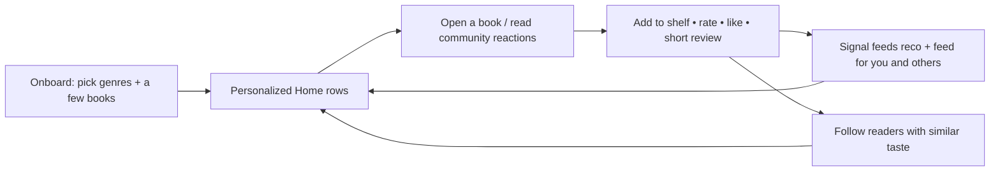

# jacopoz — Product Requirements Document

> Social book discovery for readers. **Discover books through people with similar taste.**
> Netflix for discovery, Twitter/Reddit for community, Goodreads only for the catalog underneath.

---

## 1. Vision & non-goals

**Vision.** jacopoz turns "what should I read next?" into a social act. A reader opens the app to a
personalized, Netflix-style home of book rows built from the taste of people like them, reads short
community reactions, and adds the next book to a shelf in two taps. The unit of value is not the
catalog — it is **the signal that a book is worth your time because someone whose taste you trust
loved it.**

**What jacopoz is NOT (explicit non-goals):**

| Non-goal | Rationale |
|---|---|
| A Goodreads clone / cataloging tool | We do not compete on completeness of metadata, editions, or shelving taxonomy. The catalog is a means, not the product. |
| A reading tracker with rich progress logging | Page-by-page progress, reading challenges, yearly goals → deferred / out of scope for beta. |
| A long-form review platform | Reviews are short social reactions, not essays. Length is capped and rating-only posts are first-class. |
| A store / e-reader | No in-app reading, no DRM, no cart. Purchase is a single affiliate hand-off. |
| A chat / DM / realtime app | No direct messaging, no live presence in beta. |
| An ML recommender | Recommendations are transparent SQL heuristics (see `ALGORITHMS.md`). ML is a swap-in, not a requirement. |

The single differentiator: **social discovery**. Everything that does not serve "find your next book
through people like you" is deprioritized.

---

## 2. Target users / personas

**Persona A — "Chiara, the drifting reader" (primary).**
25–40, reads 10–25 books/year, finishes a book and stalls on the next pick. Uses Goodreads only to log,
finds it sterile. Wants a curated nudge and light social proof, not a spreadsheet. **Core need:** a
trustworthy "read this next." Activation = completes onboarding taste picker and adds ≥1 book to a shelf.

**Persona B — "Marco, the opinionated tastemaker" (supply side).**
Reads 40+ books/year, has strong opinions, already reviews on Storygraph/Reddit. Wants a small,
high-signal audience and to be *followed*. **Core need:** low-friction posting (rating + two lines) and
visible influence (likes, followers, "popular with readers like you"). Marco produces the content that
makes Chiara's feed and reco work — critical for the two-sided cold-start.

**Persona C — "Giulia, the genre native" (secondary).**
Deep in one lane (fantasy, romance, thriller). Cares about genre rows and finding others with the exact
same niche taste. **Core need:** genre-dense discovery and taste-neighbour follows.

---

## 3. Core value loop

The loop must close on **day one for a new user with zero social graph**: onboarding taste + seed
catalog + trending backstop guarantee non-empty rows before the user has done anything (see cold-start
in `CTO-REVIEW.md`). Every write (shelf/rating/like/review/follow) enriches both the writer's future
Home and other users' collaborative signal.

---

## 4. Feature scope

Legend: ✅ in-scope for that milestone · ⬚ not in that milestone · ➕ new in that milestone.

| Feature | MVP | Beta | v2 |
|---|:--:|:--:|:--:|
| Email/password auth + email confirmation | ✅ | ✅ | ✅ |
| Onboarding taste picker (genres + a few books) | ✅ | ✅ | ✅ |
| Canonical catalog + search (`search_books`) | ✅ | ✅ | ✅ |
| On-demand ingestion from Google Books / Open Library (`ingest-book`) | ✅ | ✅ | ✅ |
| Book page (metadata, avg rating, community reactions) | ✅ | ✅ | ✅ |
| Shelves: want_to_read / reading / read, like, 1–5 rating | ✅ | ✅ | ✅ |
| Short reviews (≤5000 chars) + spoiler flag | ✅ | ✅ | ✅ |
| Rating-only / one-line posts | ✅ | ✅ | ✅ |
| Threaded comments (single level) | ⬚ | ✅ | ✅ |
| Likes on reviews/comments (`toggle_like`) | ⬚ | ✅ | ✅ |
| Follows + follower/following counts | ⬚ | ✅ | ✅ |
| Netflix-style Home rows | ⬚ | ✅ | ✅ |
| Non-chronological community feed (`get_community_feed`) | ⬚ | ✅ | ✅ |
| Recommendations (`get_recommendations`) | ⬚ | ✅ | ✅ |
| Profile page (shelves, reviews, followers) | ✅ | ✅ | ✅ |
| Reporting + moderation lifecycle | ⬚ | ✅ | ✅ |
| Analytics event sink | ⬚ | ✅ | ✅ |
| Avatar upload to Storage | ⬚ | ✅ | ✅ |
| Amazon affiliate hand-off (`amazon_affiliate_url`) | ⬚ | ✅ | ✅ |
| Gamification (XP, levels, streaks, badges) — *scaffold only* | ⬚ | ⬚ (design) | ✅ (activate) |
| Premium / ad-free entitlement — *scaffold only* | ⬚ | ⬚ (dormant) | ✅ |
| In-app ads | ⬚ | ⬚ (OFF) | ✅ |
| Push notifications | ⬚ | ⬚ | ✅ |
| Realtime feed / live counters | ⬚ | ⬚ | ✅ |
| Reading-progress micro-posts | ⬚ | ⬚ | ✅ |
| Book clubs / group reads | ⬚ | ⬚ | ✅ |
| i18n (IT/EN) | ⬚ | ⬚ | ✅ |

---

## 5. Netflix-style Home rows spec

Home is a vertical list of horizontally-scrolling rows. Each card is the `book_card` shape (see
`API.md`): cover, title, authors, avg rating, popularity counters. Tapping a card opens the book page.
Rows render in priority order; empty rows are hidden. Data comes from RPCs — no client-side ranking.

| Row | Source | Ordering | Cold-start behavior |
|---|---|---|---|
| **Per te** (For you) | `get_recommendations()` | `score desc` (blended reco) | Falls back to genre-pref + popularity; reason string per card, never empty |
| **Perché hai letto X** (Because you read X) | `get_recommendations()` filtered/labelled by the strongest `reason` ("Because you read authors you love"); X = a recent positive book | reco `score` | Hidden until the user has ≥1 positive book (liked/read/rating≥4) |
| **Popolari** (Popular) | `get_trending_books()` | popularity with recency tilt | Always populated from seed catalog |
| **Genre rows** (Fantasy, Sci-Fi, …) | `search_books('')` / trending scoped to a `genres.slug` the user picked in onboarding | popularity within genre | Driven by `user_genre_prefs`; guaranteed content post-onboarding |
| **Nuove uscite** (New releases) | catalog filtered `published_year >= now-3y` (trending already tilts +25% toward recent) | recency then popularity | Seed catalog spans recent years |
| **Più discussi** (Most discussed) | catalog ordered by `reviews_count` (+ `comment_count` aggregate) | discussion volume | Needs review volume → seeded reviews for beta |

Rules:
- Home never shows a spinner-to-empty state. If personal signals are thin, `get_recommendations`
  degrades to popularity and returns the reason `"Trending on jacopoz"`.
- Books already on the caller's shelf are excluded from reco rows (server-side).
- Row payloads are paged (`p_limit`/`p_offset`) and cached client-side via React Query.

---

## 6. Book page spec

A single book (`books.id`). Sections:

1. **Header** — cover (hotlinked `cover_url`), title, subtitle, authors, published year, page count,
   language.
2. **Aggregate rating** — `book_avg_rating` (round(rating_sum/rating_count,2)) + `rating_count`;
   popularity counters (`reads_count`, `saves_count`, `likes_count`, `reviews_count`).
3. **Shelf control** — status selector (want_to_read / reading / read), like toggle, personal 1–5
   rating. Writes are plain RLS-guarded upserts to `user_books` (canonical rating source).
4. **Community reactions** — visible reviews for this book (`reviews` where `status='visible'`), each
   with author, rating, body, spoiler flag (blurred until tapped), like + comment counts, comments.
5. **Buy** — affiliate button via `amazon_affiliate_url(isbn_13)`; hidden when no ISBN is known.
6. **Description** — provider description text.

If the book is not yet in the catalog (arrived via search), the client triggers `ingest-book` to
create/resolve the canonical row before rendering.

---

## 7. Community feed spec (non-chronological)

The "For you" community feed (`get_community_feed`) is the heart of the product. It is a ranked stream
of **reviews** (not raw activity), each returned as a `feed_item` (review + author + book + viewer
state + score). See `ALGORITHMS.md` for the full weighting.

- **Non-chronological by design.** Ranking blends engagement (0.30), quality (0.20), affinity to the
  viewer (0.20: follows author = 1.0, shares genre = 0.5), and freshness (0.30, 48h half-life). Recent
  is favored but a great older review from someone you follow still surfaces.
- Excludes the viewer's own reviews and non-`visible` content.
- Each item carries `viewer_has_liked` so the like button renders correct state in one round trip.
- Actions inline: like (`toggle_like`), open review, comment, open book, open author profile, report.
- Spoiler-flagged bodies render blurred until tapped.

---

## 8. Profile spec

Public profile keyed by `profiles.username`.

- **Header:** avatar (`avatar_url`, Storage), display name, username, bio, `followers_count`,
  `following_count`, `books_read_count`. Follow/unfollow button (own profile → edit).
- **Shelves:** tabs for read / reading / want_to_read from `user_books` (public reads).
- **Reviews:** the user's visible reviews.
- **Taste:** genres from `user_genre_prefs` (drives "readers like you").
- **Gamification placeholder:** level/points columns exist (`profiles.points`, `user_gamification`) but
  are not surfaced in beta.
- Own-profile settings: edit display_name/bio/avatar, sign out, delete account (cascades `auth.users`).

---

## 9. Success metrics (beta validation)

Target cohort: 100–500 private-beta users. Metrics are computed from `analytics_events` + table state.

| Metric | Definition | Beta target (directional) |
|---|---|---|
| **Activation** | % of signups that complete onboarding taste (`onboarded_at` set / `onboarding_completed` event) AND add ≥1 shelf book | ≥ 60% |
| **Retention D1 / D7 / D30** | % of activated users returning on day 1 / 7 / 30 (session/`book_viewed` events) | D1 ≥ 40%, D7 ≥ 20%, D30 ≥ 10% |
| **Review conversion** | % of active users who write ≥1 review (`review_created`) | ≥ 25% |
| **Feed engagement** | likes+comments per feed impression; % of sessions with ≥1 feed interaction (`review_liked`, `comment_created`) | ≥ 30% of sessions engage |
| **Discovery efficacy** | % of shelf-adds originating from a reco/feed surface vs. search | track; want reco/feed ≥ search |
| **Supply health** | reviews per active reader; # of users producing ≥5 reviews (tastemakers) | ≥ 10 active tastemakers |

Validation hypothesis: **if activated users hit D7 ≥ 20% and reco/feed drives most shelf-adds, social
discovery is working.** If retention is flat and adds come only from search, the product is a worse
Goodreads and the thesis fails.

---

## 10. Explicitly deferred to v2

- Gamification **activation** (XP engine, levels, streaks, badge awarding). Tables scaffolded now; no
  client writes; see `0008`.
- Premium features + paywall (entitlement modelled in `0009`, dormant) and **in-app ads** (`ads_enabled`
  = false).
- Push notifications and in-app notifications inbox.
- Realtime feed / live counters (Supabase Realtime).
- Reading-progress micro-posts ("on page 200, gripped").
- Book clubs / group reads / buddy reads.
- Multi-level comment threads (beta caps at single-level replies).
- i18n beyond hard-coded IT/EN copy.
- Warehouse export of `analytics_events`, cohort dashboards.
- CDN / cached cover storage (beta hotlinks providers).
