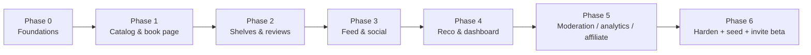

# jacopoz — Roadmap & Backlog

Phased roadmap to a stable private beta, then a prioritized engineering TODO, then the v2 backlog. The
database backend is already built and validated (`supabase/migrations/0001..0010`, `seed.sql`,
`functions/ingest-book`); remaining work is mostly app (`app/`) + glue + content.

---

## 1. Phased roadmap

| Phase | Goal | Key deliverables |
|---|---|---|
| **0 — Foundations** | app talks to Supabase | Expo app boots (iOS/Android/Web), supabase-js client + auth session (secure-store), React Query provider, env wiring, sign-up/in/out + email confirm, onboarding taste picker → `user_genre_prefs` + `onboarded_at` |
| **1 — Catalog & book page** | find & view a book | `search_books` UI, wire `ingest-book` for misses, book page (metadata, avg rating, buy button via `amazon_affiliate_url`) |
| **2 — Shelves & reviews** | contribute | shelf control (upsert `user_books`: status/like/rating), write short review, view visible reviews, own profile shelves/reviews |
| **3 — Feed & social** | the actual product | `get_community_feed` screen, `toggle_like`, comments, follows, public profiles |
| **4 — Reco & dashboard** | Netflix-style Home | `get_recommendations` + `get_trending_books` rows, "Per te / Popolari / genre / Nuove uscite / Più discussi", reason labels |
| **5 — Moderation / analytics / affiliate** | operability + revenue | report UI (`report_content`), moderator surface (`moderate_content`), analytics event emission, affiliate links live |
| **6 — Harden + seed + invite** | ship to 100–500 | seed reviews/graph, empty-state screens, avatar upload, e2e smoke test, EAS build, promote a moderator, invite |

---

## 2. Prioritized engineering TODO (to a stable private beta)

**P0 — required to launch**

| Task | Rationale | Effort |
|---|---|---|
| Auth + session (sign up/in/out, email confirm) with secure-store persistence | gate everything | M |
| Onboarding taste picker → `user_genre_prefs` + set `onboarded_at` | primary cold-start signal; activation metric | M |
| Wire `ingest-book` into search flow (catalog miss → invoke → render) | catalog stays live without a client catalog writer | M |
| Book page + shelf control (upsert `user_books`) | core write loop | M |
| Home rows from `get_recommendations` / `get_trending_books` / genre | non-empty personalized Home | M |
| Community feed from `get_community_feed` + `toggle_like` | the product | M |
| **Seed reviews + minimal social graph script** | makes feed / "Più discussi" non-empty at launch | M |
| **Empty-state screens** (no follows, no reviews, thin reco) | never show a dead screen | S |
| Env config + secrets (anon key in app; function secrets server-side) | correctness + safety | S |
| **e2e smoke test** (signup → onboard → search → shelf → review → feed → like) | release gate | M |

**P1 — strongly wanted for a good beta**

| Task | Rationale | Effort |
|---|---|---|
| **Avatar upload to Storage** (≤5 MiB) + set `profiles.avatar_url` | identity in feed/profile | M |
| Comments UI (create/list, single-level replies) | feed depth, engagement metric | M |
| Follows UI + public profile | social graph, affinity term feeds reco/feed | S |
| Report UI (`report_content`) | safety from day one | S |
| Basic moderator surface (list reports, `moderate_content`) | operability | M |
| **Analytics event emission** (vocabulary in `API.md`) | measure activation/retention/engagement | M |
| Affiliate button wired (`amazon_affiliate_url`, `affiliate_click` event) | only live revenue channel | S |
| Read `app_config` at launch (flags, min version) | remote control without app update | S |

**P2 — nice to have before public**

| Task | Rationale | Effort |
|---|---|---|
| **In-app notifications table + inbox** (likes/comments/follows) | retention loop without push | M |
| Pull-to-refresh + pagination polish on rows/feed | UX | S |
| Spoiler blur interaction | quality-of-life | S |
| Search filters by genre | discovery depth | S |
| Cover fallback / broken-hotlink handling | reliability of hotlinked covers | S |
| Web build polish (react-native-web) | shareable links | M |

---

## 3. Future backlog (v2)

Scaffolding already exists for gamification (`0008`), monetization (`0009`), and the activity log
(`0007`) — activation needs **no hot-table migration**.

| Item | Priority | Rationale | Effort |
|---|---|---|---|
| **Activate gamification** (points engine → `xp_ledger` truth + `user_gamification` cache, award `achievements`) | High | retention/engagement; scaffold ready, needs SECURITY DEFINER/service_role engine | L |
| **Push notifications** | High | re-engagement given low interaction frequency | M |
| **Realtime feed / live counters** (Supabase Realtime) | Medium | liveliness at higher volume | M |
| **Reading-progress micro-posts** | Medium | raises interaction frequency between finishes | M |
| **Premium features + paywall** (`entitlements`, `is_premium`, `premium_enabled`) | Medium | revenue; entitlement modelled, billing webhook needed | L |
| **Ad network** (flip `ads_enabled`, integrate SDK) | Low | revenue; deliberately OFF in beta | M |
| **Book clubs / group reads** | Medium | community depth, differentiator | L |
| **i18n (IT/EN)** | Medium | Italian-first audience | M |
| **Warehouse export of `analytics_events`** + cohort dashboards | Medium | product decisions at scale | M |
| **ML recommender** behind the same RPC contract | Medium | quality once data exists; swap body of `get_recommendations`, keep `book_reco` | L |
| **Multi-level comment threads** | Low | beta caps at single-level | M |
| **Cover caching to Storage / CDN** | Low | only if hotlinking gets flaky | M |
