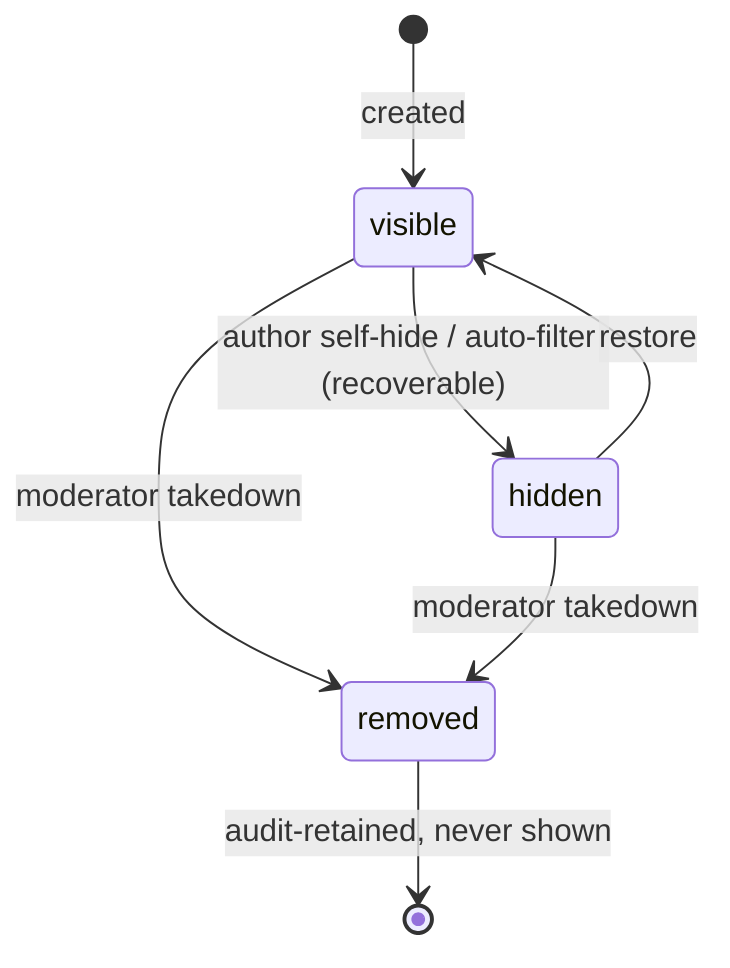
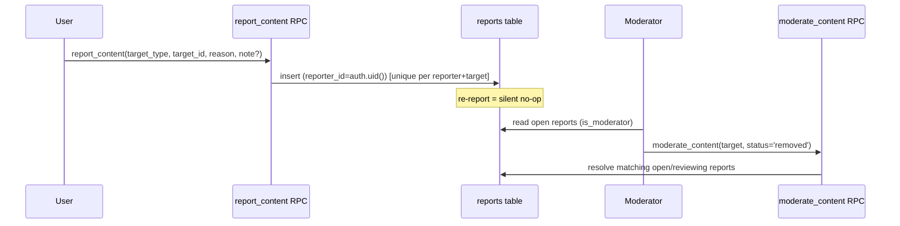

# jacopoz — Security & Moderation

Practical security posture for a 100–500 user private beta. Authorization lives in the database (RLS);
privileged paths are narrow and explicit.

---

## 1. RLS model overview

Row Level Security is enabled on every `public` table. The model is four rules:

1. **Default deny.** RLS on + no matching policy = no access. Nothing is reachable unless a policy grants
   it.
2. **Open reads.** The reading community is public: `profiles`, `genres`, `books`, `book_external_ids`,
   `user_books` (shelves), `likes`, `follows`, `user_genre_prefs`, `activities`, gamification tables,
   `app_config`, and **visible** reviews/comments are `select using (true)` (or status-scoped).
3. **Owner writes.** Mutations require `... = auth.uid()`: shelf rows (`user_id`), reviews/comments
   (`user_id`), likes (`user_id`), follows (`follower_id`), genre prefs (`user_id`), reports
   (`reporter_id`), own analytics events. Users can only touch their own data.
4. **Moderator gate.** Elevated reads/writes check `is_moderator()` — a SECURITY DEFINER function that
   returns true when `profiles.role ∈ ('moderator','admin')`. Gates `reports` read/update, moderation,
   and `app_config` writes.

**Privileged bypass paths (only two):**
- **Catalog writes** → the `ingest-book` Edge Function runs under **service_role**, which bypasses RLS.
  Clients are read-only on `books` / `book_external_ids`.
- **Moderation & signup** → **SECURITY DEFINER** functions (`moderate_content`, `handle_new_user`,
  `is_moderator`, `is_premium`, `get_recommendations`, `get_community_feed`) run with the definer's
  rights and a pinned `search_path = public`.

Content-visibility nuance: a review/comment is readable when `status='visible' OR user_id = auth.uid()
OR is_moderator()` — authors still see their own hidden/removed content; the public never sees non-visible.

---

## 2. Authentication

- **Supabase Auth**, email/password. `enable_signup = true`; **email confirmation ON in production**
  (`[auth.email] enable_confirmations = true`) — relax locally only.
- **JWT** carries `sub = auth.uid()`, `jwt_expiry = 3600`s, refresh-token rotation enabled. Every
  PostgREST/RPC/Storage call is authorized against this token.
- **Identity split:** `auth.users` is never exposed to clients. On signup, the SECURITY DEFINER
  `handle_new_user` trigger creates the matching `public.profiles` row with a username derived from
  metadata/email and de-duplicated with a numeric suffix. All user-facing data lives in `profiles`.
- **Redirect allow-list:** deep link `jacopoz://` plus `http://localhost:8081` and `exp://127.0.0.1:19000`
  for dev (`config.toml [auth]`). Keep this tight in production.

---

## 3. Content moderation lifecycle

`content_status` on `reviews` and `comments`:

| Status | Meaning | Public sees? | Author sees? |
|---|---|---|---|
| `visible` | normal | yes | yes |
| `hidden` | soft-hidden by author or auto-filter; recoverable | no | yes |
| `removed` | moderator takedown; kept for audit | no | yes (own) |

Transitions to `hidden`/`removed` by a moderator go through `moderate_content(target_type, target_id,
status)` (SECURITY DEFINER, guarded by `is_moderator()`), which also **auto-resolves any open reports**
on that target (`status='resolved'`, `resolved_by`, `resolved_at`).

---

## 4. Report flow

- One open report per `(reporter, target_type, target_id)`; re-reporting is a no-op (unique constraint).
- Only moderators can read/update `reports`. Reasons ≤80 chars, notes ≤500.
- Targets can be `review`, `comment`, `profile`, or `book`; `moderate_content` acts on review/comment
  visibility (profile/book reports are triaged manually).

---

## 5. Roles

| Role | Capabilities |
|---|---|
| `user` (default) | own content CRUD, public reads, report, like/follow/shelf/review/comment |
| `moderator` | all of user + read/update `reports`, `moderate_content`, read `analytics_events`, write `app_config`, read non-visible content |
| `admin` | same gate as moderator via `is_moderator()` (role ∈ moderator/admin); reserved for elevated ops / promoting others |

Promotion is a manual SQL update to `profiles.role` (see `DEPLOY.md`). There is no client path to
elevate a role.

---

## 6. Abuse considerations (small beta)

- **Invite-only** cohort of 100–500 keeps the blast radius small; the main risks are spam reviews/comments
  and abusive text.
- **Structural limits:** one review per (user, book); one shelf row per (user, book) requiring a real
  signal; one open report per target; length caps on all bodies (review ≤5000, comment ≤2000, bio ≤300,
  reason ≤80). `follows_no_self` prevents self-follow loops.
- **No client catalog writes** — no way to spam/poison `books`.
- **Counters can't be forged:** all denormalized counts are trigger-derived from real rows; likes toggle
  through `toggle_like`; gamification tables have no client write policy (XP can't be forged).
- **Rate limiting** is not implemented in beta; rely on invite-gating + moderation. Add per-user insert
  throttling if abuse appears (candidate for a `before insert` trigger or edge check).

---

## 7. Secrets handling

| Secret | Where | Exposure |
|---|---|---|
| `SUPABASE_ANON_KEY` | shipped in the app | **Public by design** — safe only because RLS enforces access. Never rely on it for authorization. |
| `SUPABASE_SERVICE_ROLE_KEY` | Edge Functions / server tooling only | **Server-only, never in the client.** Bypasses RLS. Gitignored `.env`, set as function secret. |
| `GOOGLE_BOOKS_API_KEY` | Edge Function secret | server-only, optional (raises quota) |
| `OPEN_LIBRARY_USER_AGENT` | Edge Function secret | server-only descriptive UA |
| `SUPABASE_DB_URL` | local tooling | server-only; contains DB password |

`.gitignore` excludes `.env`, `.env.*`, `app/.env*`, and `supabase/.env`. The service role key must
never reach the mobile bundle — the catalog writer is the Edge Function precisely so the client never
needs it.

---

## 8. GDPR / account deletion

- **Cascade delete:** `profiles.id references auth.users(id) on delete cascade`, and all owned tables
  (`user_books`, `reviews`, `comments`, `likes`, `follows`, `user_genre_prefs`, `reports`, `activities`,
  gamification, `entitlements`) cascade from `profiles`. Deleting the `auth.users` row erases the user's
  entire footprint in one operation (right to erasure).
- **`analytics_events.user_id`** is `on delete set null` — events are retained but de-identified,
  keeping aggregate analytics valid without holding personal linkage after deletion.
- **Data access/export:** a user's data is all owner-scoped rows; a support export is a per-table select
  by `user_id`.
- **Minimization:** we store no more than username, display name, optional bio/avatar, and reading
  activity. Auth (email, password hash) is managed by Supabase Auth, not in `public`.
